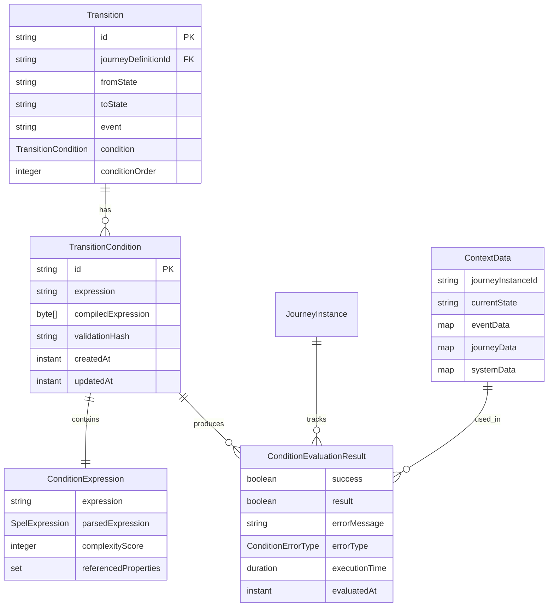

# Data Model: Conditional Transitions in Journey State Machine

**Feature**: `006-conditional-transitions`  
**Date**: 2025-03-30  
**Status**: Complete

## Domain Entities

### TransitionCondition

Represents a conditional expression that determines if a transition can be executed based on runtime context data.

**Attributes**:
- `id: String` - Unique identifier for the condition
- `expression: String` - Raw SpEL expression string
- `compiledExpression: byte[]` - Pre-compiled SpEL expression (serialized)
- `validationHash: String` - SHA-256 hash for integrity verification
- `createdAt: Instant` - Creation timestamp
- `updatedAt: Instant` - Last modification timestamp

**Business Rules**:
- Expression must be valid SpEL syntax
- Expression must not access restricted methods or properties
- Expression must evaluate to boolean result
- Validation hash must match expression content

### ConditionExpression

Value object representing a parsed and validated condition expression.

**Attributes**:
- `expression: String` - The expression string
- `parsedExpression: SpelExpression` - Parsed SpEL expression
- `complexityScore: Integer` - Complexity score for performance monitoring
- `referencedProperties: Set<String>` - Properties referenced in expression

**Validation Rules**:
- Expression must be syntactically valid
- All referenced properties must be accessible
- Complexity score must be within acceptable limits
- No circular dependencies allowed

### ContextData

Immutable value object containing runtime data available for condition evaluation.

**Attributes**:
- `journeyInstanceId: String` - Journey instance identifier
- `currentState: String` - Current journey state
- `eventData: Map<String, Object>` - Data from triggering event
- `journeyData: Map<String, Object>` - Journey instance data
- `systemData: Map<String, Object>` - System-level data (timestamp, etc.)

**Properties**:
- Immutable - cannot be modified after creation
- Thread-safe for concurrent evaluation
- Serializable for logging and debugging
- Type-safe accessors for common properties

### ConditionEvaluationResult

Value object representing the result of condition evaluation.

**Attributes**:
- `success: Boolean` - Whether evaluation succeeded
- `result: Boolean` - Evaluation result (if successful)
- `errorMessage: String` - Error message (if failed)
- `errorType: ConditionErrorType` - Type of error (if failed)
- `executionTime: Duration` - Time taken for evaluation
- `evaluatedAt: Instant` - When evaluation occurred

**Error Types**:
- `SYNTAX_ERROR` - Expression parsing failed
- `RUNTIME_ERROR` - Evaluation failed (property access, type mismatch)
- `SECURITY_VIOLATION` - Attempted access to restricted method
- `TIMEOUT` - Evaluation exceeded time limit

## Enhanced Existing Entities

### Transition (Enhanced)

Existing transition entity enhanced with optional condition support.

**New Attributes**:
- `condition: TransitionCondition` - Optional condition for transition
- `conditionOrder: Integer` - Order for evaluating multiple conditions

**Behavior Changes**:
- Transitions without conditions behave as before (event-only)
- Transitions with conditions require evaluation before execution
- Multiple transitions from same state evaluated in order

### JourneyInstance (Enhanced)

Existing journey instance enhanced with condition evaluation context.

**New Attributes**:
- `lastConditionEvaluation: ConditionEvaluationResult` - Last evaluation result
- `conditionEvaluationHistory: List<ConditionEvaluationResult>` - Evaluation history

**Behavior Changes**:
- Maintains audit trail of condition evaluations
- Stores evaluation context for debugging
- Tracks evaluation performance metrics

## Enums

### ConditionOperator

Enumeration of supported operators in condition expressions.

**Values**:
- `LOGICAL_AND` - Logical AND operator
- `LOGICAL_OR` - Logical OR operator
- `LOGICAL_NOT` - Logical NOT operator
- `EQUALS` - Equality comparison
- `NOT_EQUALS` - Inequality comparison
- `GREATER_THAN` - Greater than comparison
- `LESS_THAN` - Less than comparison
- `GREATER_EQUAL` - Greater than or equal comparison
- `LESS_EQUAL` - Less than or equal comparison

### ConditionErrorType

Enumeration of condition evaluation error types.

**Values**:
- `SYNTAX_ERROR` - Expression syntax is invalid
- `RUNTIME_ERROR` - Runtime evaluation error
- `SECURITY_VIOLATION` - Security constraint violation
- `TIMEOUT` - Evaluation exceeded time limit
- `UNKNOWN_ERROR` - Unexpected error

## Relationships



## Validation Rules

### Expression Validation

1. **Syntax Validation**: Expression must be valid SpEL syntax
2. **Security Validation**: No access to restricted methods or properties
3. **Performance Validation**: Complexity score within acceptable limits
4. **Semantic Validation**: Expression must evaluate to boolean

### Context Data Validation

1. **Property Access**: Only whitelisted properties accessible
2. **Type Safety**: Type checking for comparison operations
3. **Null Handling**: Proper null value handling in expressions
4. **Circular References**: Detection and prevention of circular dependencies

### Evaluation Validation

1. **Time Limits**: Evaluation must complete within 10 seconds
2. **Memory Limits**: Evaluation must not exceed memory thresholds
3. **Thread Safety**: Concurrent evaluation must be thread-safe
4. **Result Consistency**: Same input must produce same output

## Persistence Schema

### MongoDB Collections

#### transitions Collection

```json
{
  "_id": "transition_id",
  "journeyDefinitionId": "journey_def_id",
  "version": 1,
  "fromState": "START",
  "toState": "PROCESSING",
  "event": "SUBMIT",
  "condition": {
    "id": "condition_id",
    "expression": "context.data.amount > 1000 AND context.event.priority == 'HIGH'",
    "compiledExpression": "base64_encoded_compiled_spel",
    "validationHash": "sha256_hash",
    "createdAt": "2025-03-30T10:00:00Z",
    "updatedAt": "2025-03-30T10:00:00Z"
  },
  "conditionOrder": 1,
  "createdAt": "2025-03-30T10:00:00Z",
  "updatedAt": "2025-03-30T10:00:00Z"
}
```

#### conditionEvaluationLogs Collection

```json
{
  "_id": "evaluation_log_id",
  "journeyInstanceId": "journey_instance_id",
  "transitionId": "transition_id",
  "conditionId": "condition_id",
  "contextData": {
    "journeyInstanceId": "journey_instance_id",
    "currentState": "START",
    "eventData": {...},
    "journeyData": {...},
    "systemData": {...}
  },
  "evaluationResult": {
    "success": true,
    "result": true,
    "errorMessage": null,
    "errorType": null,
    "executionTime": "PT0.005S",
    "evaluatedAt": "2025-03-30T10:00:00Z"
  },
  "correlationId": "request_correlation_id",
  "evaluatedAt": "2025-03-30T10:00:00Z"
}
```

## Performance Considerations

### Indexing Strategy

1. **Transitions Collection**:
   - Index on `journeyDefinitionId` + `version` + `fromState` + `event`
   - Index on `condition.id` for condition lookups

2. **ConditionEvaluationLogs Collection**:
   - Index on `journeyInstanceId` for journey-specific queries
   - Index on `evaluatedAt` for time-based queries
   - TTL index on `evaluatedAt` for automatic cleanup (e.g., 30 days)

### Caching Strategy

1. **Expression Cache**: In-memory cache of compiled expressions
2. **Condition Cache**: Cache frequently used conditions
3. **Evaluation Result Cache**: Cache results for identical context data
4. **Context Data Cache**: Cache processed context data

### Memory Management

1. **Expression Compilation**: Limit number of compiled expressions in memory
2. **Evaluation History**: Limit size of evaluation history per journey
3. **Log Cleanup**: Automatic cleanup of old evaluation logs
4. **Cache Eviction**: LRU eviction policies for memory management

## Security Considerations

### Expression Security

1. **Property Access Control**: Whitelist accessible properties
2. **Method Filtering**: Block access to dangerous methods
3. **Expression Complexity**: Limit expression complexity
4. **Input Sanitization**: Validate and sanitize expression inputs

### Data Security

1. **Sensitive Data**: Prevent exposure of sensitive data in expressions
2. **Audit Trail**: Log all condition evaluations for security auditing
3. **Access Control**: Restrict access to condition management endpoints
4. **Data Encryption**: Encrypt stored expressions if needed

## Testing Considerations

### Unit Testing

1. **Expression Parsing**: Test expression parsing and validation
2. **Condition Evaluation**: Test condition evaluation with various contexts
3. **Error Handling**: Test error scenarios and edge cases
4. **Performance**: Test evaluation performance and memory usage

### Integration Testing

1. **End-to-End Flows**: Test complete journey execution with conditions
2. **Concurrent Evaluation**: Test concurrent condition evaluation
3. **Database Operations**: Test persistence and retrieval of conditions
4. **API Integration**: Test REST API endpoints for condition management

### Property-Based Testing

1. **Expression Generation**: Generate random valid expressions
2. **Context Generation**: Generate random context data
3. **Evaluation Properties**: Test mathematical properties of evaluation
4. **Edge Cases**: Test boundary conditions and edge cases
